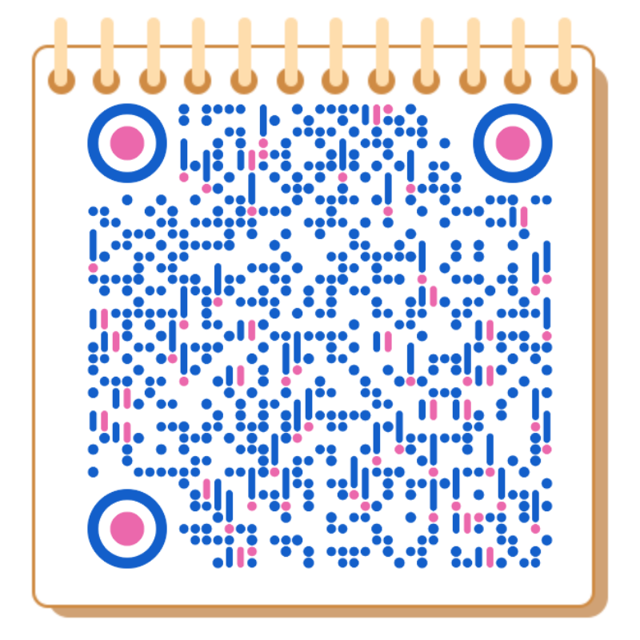

# AI 从 0 到 1 系统性学习资料

<Info>
  这一部分现在按“学习资料归档区”维护。仓库会继续保留原始资料文件，但只有少数入口页会作为已维护页面继续在站点中展示。
</Info>

## 这部分适合谁

- 想系统补 AI 基础，但不一定马上部署 OpenClaw 的读者
- 想回看项目早期整理的中文学习资料、外部资源和历史背景说明的读者
- 想从原始资料中继续挑选、清洗、重写内容的贡献者

## 先从这 3 个入口开始

<CardGroup cols={3}>
  <Card title="归档说明" icon="archive" href="/ml/archive">
    了解哪些资料仍然作为站点页面维护，哪些原始文件只保留在仓库中。
  </Card>
  <Card title="资料收藏" icon="book-open" href="/ml/collect">
    浏览长期整理的外部资源、教程、工具和链接。
  </Card>
  <Card title="仓库源码" icon="github" href="https://github.com/lilinji/GeneTind-docs/tree/main/ml">
    直接查看 `ml/` 目录中的原始资料文件和历史整理痕迹。
  </Card>
</CardGroup>

## 当前维护方式

| 内容类型 | 状态 | 说明 |
| --- | --- | --- |
| `/ml/index`、`/ml/collect`、`/ml/archive` | 维护中 | 当前站点继续展示和整理的入口页 |
| `ml/**/*.md` | 仓库保留 | 原始资料、旧草稿、翻译件和研究素材，不直接当成成品页发布 |
| 旧版前言、作者说明、历史整理内容 | 保留展示 | 继续放在本页下方，方便回看和后续重写 |

## 推荐阅读方式

- 如果你想快速浏览，优先看归档说明和收藏页。
- 如果你想按主题深挖，再去仓库里的 `ml/` 目录查看原始文件。
- 如果你想把这里的内容整理成更可维护的站点页，先读 [贡献文档](/contribute/docs)。

## 保留的历史前言

下面这部分保留自项目早期整理，用于记录作者、背景和原始选题方向。它仍然有参考价值，但不代表当前站点全部内容都处于同样的维护状态。

### 勇者招募

目标做成至少在中文互联网里质量最高、最详细的 ChatGPT 文档，但由于我们团队的几位作者终究是时间有限，我们希望更多的有志之士能够加入我们和我们一起做这个文档。如果你对 ChatGPT 这件事情很感兴趣并且每周能固定拿出 3 小时以上投入到文档里，我们诚挚邀请你加入我们。

## 保留的历史正文

> 以下内容保留自项目早期的 ChatGPT 学习资料整理，主要用于回看背景、作者说明和原始选题方向。

> 主要作者简介：
>
> * Hank，计算机本硕，7年大数据与人工智能应用从业者，曾就职 YIMIAN by Ascential、腾讯、高榕资本，目前正在探索 AI 领域的创业机会
> * Ginwiahzy，目前北京大学计算机本科大四就读，下学期本校就读 PhD，主要研究方向形式化验证和理论计算机科学，目前正在探索 AI 如何提升科研/日常工作流的效率 如果你有兴趣加入这个文档的创作、或者加入我的团队、或者单纯是想了解最新的资讯，请联系下面这个微信加入微信讨论群
> * Ringi，数字经济硕士，10年IT大数据与AI工作场景、工作于 BGI、国家超算中心、博奥生物，目前专注于人工智能在生物医药的探索与研究

如果你有兴趣加入这个文档的创作、或者加入我的团队、或者单纯是想了解最新的资讯，请联系下面这个微信公众号、留言加入微信讨论群

### 历史相关链接

以下链接保留为历史记录，不代表当前 Mintlify 站点的主入口：https://gnero.genetind.com/

### 文档介绍

#### 这个文档不适合谁

* **第一，这不是个“游戏攻略”**：

如果你是一个纯粹的玩家，也不关心 ChatGPT 的是什么、为什么和能干什么，那么这个文档可能不太适合你。在这个文档里我们比较少地提及了具体的操作步骤，比如，怎么魔法上网，怎么注册账号，怎么把 ChatGPT 接入 Siri 或者和 midjourney 一起生成图片，而且网络上已经有足够多的这一类的教程，我们就不过多赘述了。

* **第二，这也不是个代码教学教程**：

如果你是正在寻找一个本地部署大语言模型的代码教程，那么这个教程同样可能也帮不到你。虽然在这个文档里提及了非常多 NLP、大语言模型的知识，但极少地涉及具体的代码。

### 内容模块简介

#### 1. 基础介绍

#### 2. 底层技术理解

如果想要理解 ChatGPT 的运作原理，或者 ChatGPT 的能力边界在哪里，再或者未来它会发展成什么样、对我们有什么影响这些问题，不了解底层技术我们认为是无法回答这些问题的。

而且，如果希望对于 AI 的使用和理解上领先你的同事，甚至有打算在未来从事 GPT 相关工作，这一块儿内容更是重中之重，它关系着未来你遇到 ChatGPT 相关问题时你的思考方式。目前对于大部分人来说，AI 是个黑匣子，我们不知道它为什么会这样回答，那么理解技术原理之后也许就能够帮助我们更好地使用它。

不过，我也理解并不是所有的读者都有深厚的计算机背景知识，我作为一个三脚猫代码能力的产品经理，也一直以**「尽可能地让非专业人士也能够读懂」**的原则在做这部分的内容。

当然，如果你只是单纯地想了解一下 ChatGPT 这个新玩意儿，暂时不想学的那么深入，可以跳过这一部分的阅读，这里的知识并不影响你阅读后续的内容

#### 3. 行业观察

更偏向从投资人或者分析师的角度对于 ChatGPT 相关行业的解读，会包含每日更新的最新新闻、行业概览信息以及发展历程、产业链上下游及相关公司的分析，在更多视角里则会收集各路从业大佬的访谈、文章等。

#### 4. 应用场景

更偏向于探讨 ChatGPT 带来的变革会在各行各业、各个场景中有什么样的落地、带来什么价值、可能会让那个场景发生什么样的变化。医疗、能源、制造业、线上办公、新闻媒体等等等等，我们也会邀请那个领域的专家来审核甚至撰写相关内容。

#### 5. 实操技巧

> **纸上得来终觉浅，绝知此事要躬行**

#### 6. 其他

#### 7.关于作者

